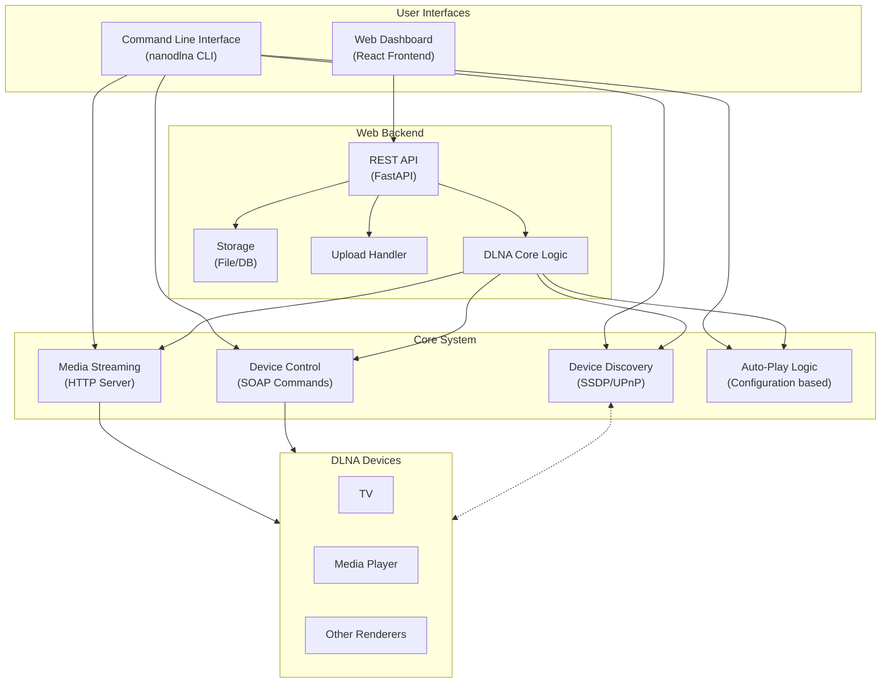

# Architecture Overview

This document outlines the high-level architecture of the `nano-dlna` project, describing the key components, their interactions, and the overall system design.

## System Architecture Diagram

## Components

### 1. Command-Line Interface (`nanodlna` Package)

The CLI component provides the core functionality that enables users to interact with DLNA devices:

* **Key Modules:**
  * `cli.py`: Main entry point handling command-line arguments with subcommands for `list`, `play`, and `seek` operations
  * `dlna.py`: Implements UPnP/DLNA communication, including device discovery via SSDP and control via SOAP actions
  * `devices.py`: Manages discovered device information and provides device selection functionality
  * `streaming.py`: Implements an HTTP server to stream media files to DLNA renderers
  * `transcreen.py`: Contains specialized logic for "Transcreen" devices that require specific handling

* **Key Features:**
  * Device discovery using SSDP protocol
  * Media streaming via HTTP server
  * Playback control via UPnP AVTransport service
  * Support for video, audio, and subtitles
  * Configuration-based auto-play functionality

### 2. Web Dashboard

The web dashboard provides a user-friendly graphical interface for managing DLNA devices and media:

#### 2.1 Backend (`web/backend/`)

* **Framework:** FastAPI (Python)
* **Key Components:**
  * **API Endpoints:** RESTful API for device discovery, video management, and playback control
  * **Core DLNA Logic:** Implementation or reuse of the core DLNA functionality (discovery, streaming, control)
  * **Video Management:** Handling of video file uploads, storage, and metadata
  * **Device Management:** Tracking and management of discovered DLNA devices

* **Storage:**
  * Media files stored in `web/uploads/`
  * Application data (device information, video metadata) stored in database or filesystem (`web/data/`)

#### 2.2 Frontend (`web/frontend/`)

* **Framework:** React (JavaScript)
* **Key Components:**
  * **Device Management UI:** Interface for viewing and selecting devices
  * **Video Management UI:** Interface for uploading, selecting, and managing videos
  * **Playback Controls:** UI for play, pause, stop, seek actions
  * **Configuration:** Interface for auto-play configuration (if applicable)

### 3. Utility Scripts

Several helper scripts provide additional functionality:

* **Media Management:**
  * `clean_videos.py`: Cleans up the video database, removing missing or duplicate entries
  * `add_config_videos.py`: Adds videos to the configuration for auto-play functionality

* **System Management:**
  * `run_dashboard.sh`: Starts the web dashboard (likely using Docker)
  * `stop_dashboard.sh`: Stops the web dashboard

## Core Concepts

### DLNA/UPnP Protocol Implementation

The system interacts with DLNA devices using the following UPnP protocols:

1. **Simple Service Discovery Protocol (SSDP):**
   * Used to discover compatible devices on the local network
   * Implemented via M-SEARCH broadcast messages

2. **UPnP Device Description:**
   * After discovery, device descriptions are fetched to obtain service information
   * Device description XMLs provide URLs for control and event subscription

3. **UPnP AVTransport Service:**
   * Used to control media playback on renderer devices
   * Key actions: `SetAVTransportURI`, `Play`, `Pause`, `Stop`, `Seek`
   * Commands sent as SOAP requests to control URLs

### Media Streaming Architecture

1. **HTTP Server:**
   * An embedded HTTP server serves media files to DLNA renderers
   * Server runs on the local machine and generates URLs that are accessible to DLNA devices

2. **Media Types:**
   * Video files (various formats)
   * Audio files
   * Subtitle files (associated with videos)

3. **Process Flow:**
   * HTTP server starts on local machine
   * Media URL is sent to DLNA device via SetAVTransportURI
   * DLNA device connects to the HTTP server to stream the media
   * Playback commands control the media rendering

### Auto-Play Configuration

The auto-play feature uses a configuration-driven approach:

1. **Configuration Files:**
   * JSON format (`my_device_config.json`, `tramscreem+device_config.json`)
   * Maps device identifiers to specific video files

2. **Process Flow:**
   * Devices are discovered on the network
   * Discovered devices are matched against configuration
   * When a match is found, the associated video is automatically played

## Deployment Architecture

The project can be deployed in multiple ways:

1. **CLI Tool:**
   * Installed via pip (`pip install nanodlna`)
   * Run directly from command line

2. **Web Dashboard:**
   * Deployed using Docker/Docker Compose
   * Frontend container (React, served via Node.js)
   * Backend container (FastAPI, Python)
   * Optional database container (if applicable)
   * Orchestrated with Docker Compose

## Integration Points

The architecture is designed with several integration points:

1. **CLI to Core:** Command-line arguments trigger core functionality
2. **Web Frontend to API:** React frontend communicates with FastAPI backend via HTTP requests
3. **API to Core Logic:** Backend API endpoints use core DLNA functionality
4. **Core to DLNA Devices:** System communicates with DLNA devices via UPnP/DLNA protocols
5. **Utility Scripts to System:** Helper scripts interact with the system's data storage and configuration
